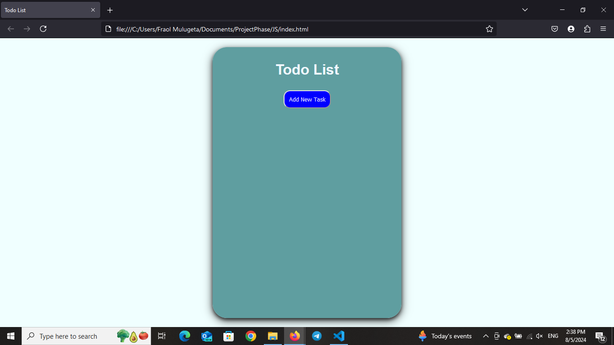
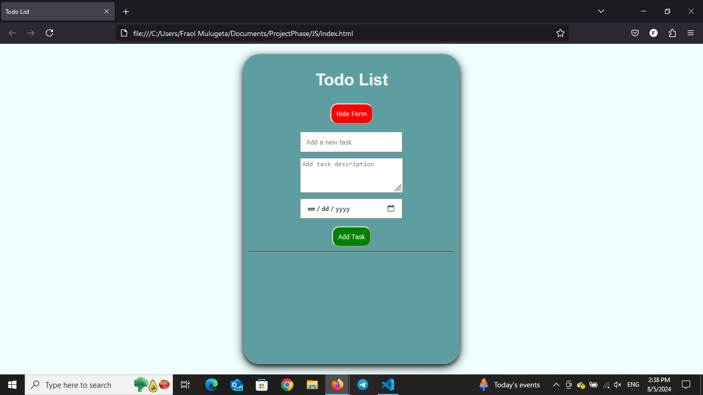
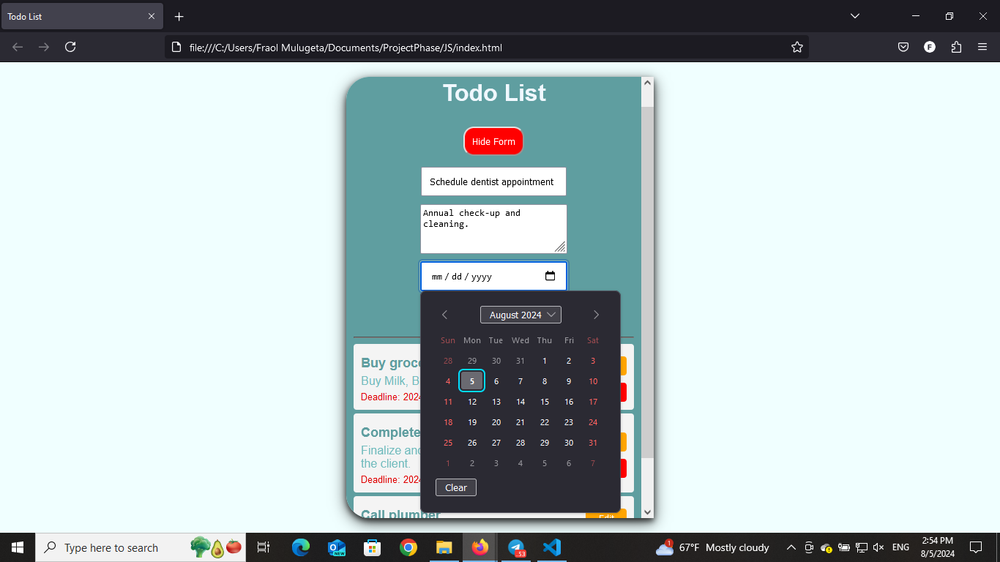
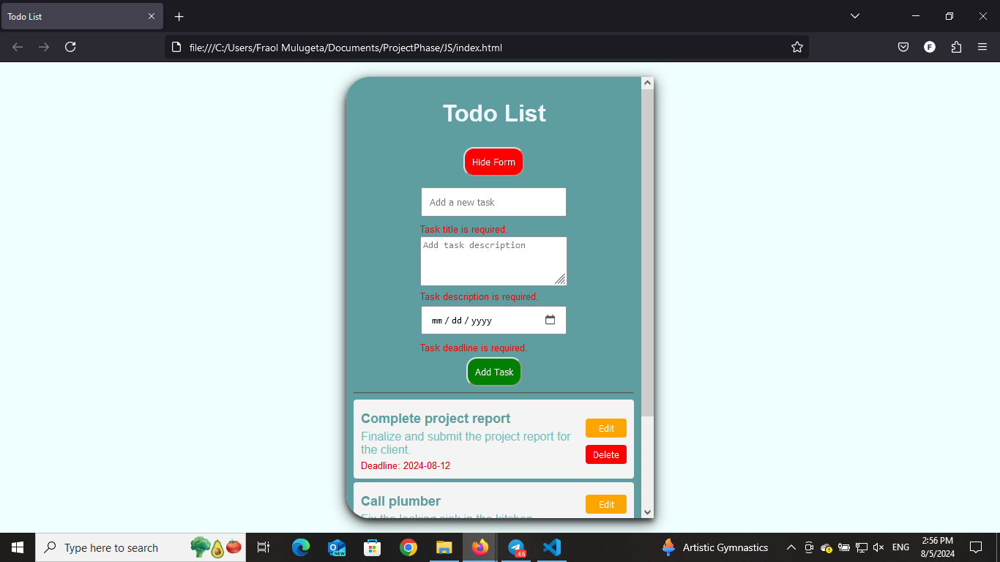
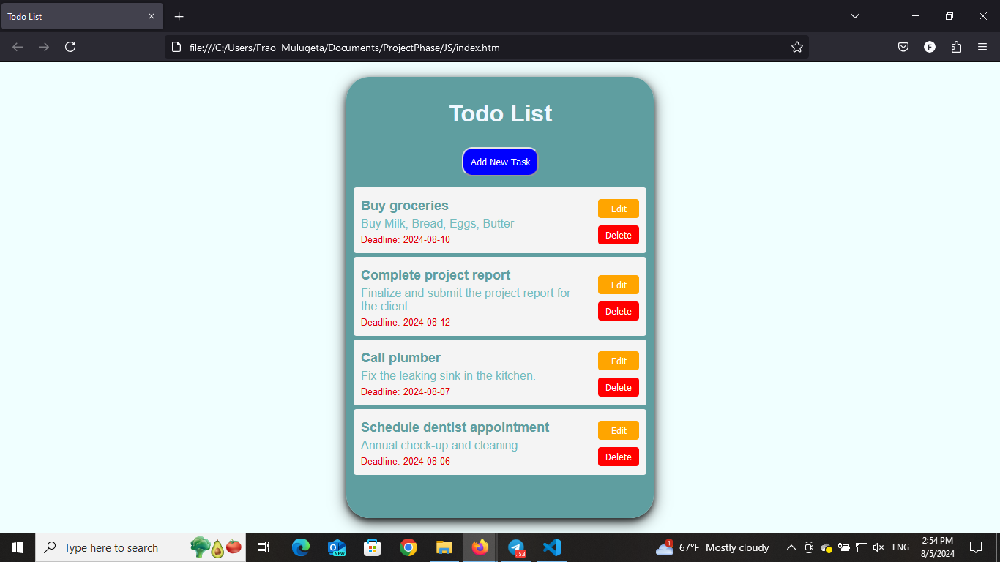
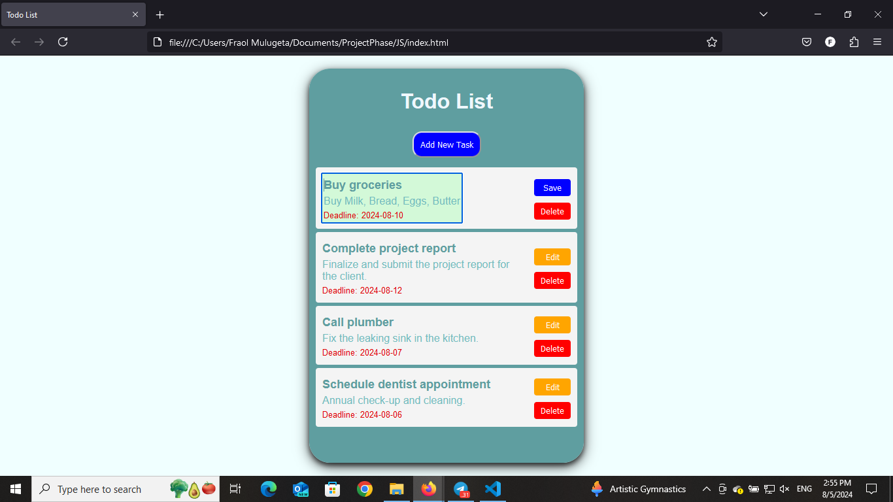
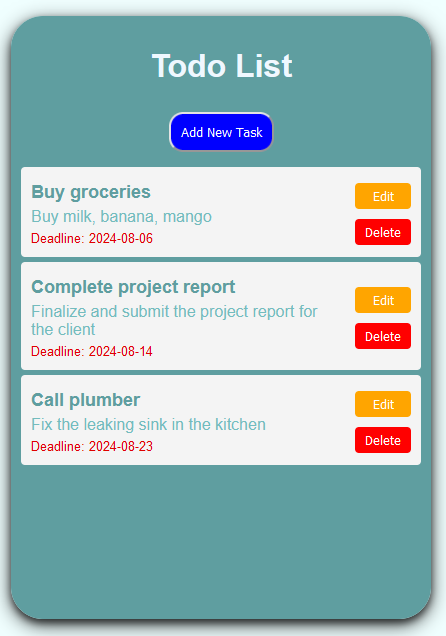
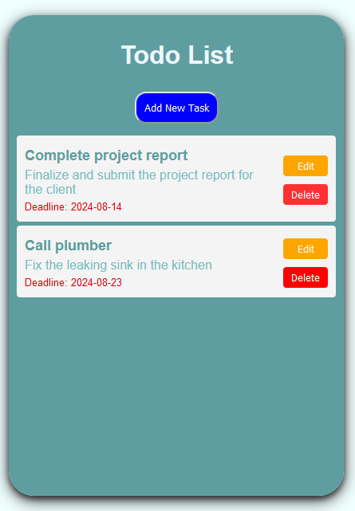

# Todo List Application

A simple Todo List application built with HTML, CSS, and JavaScript. This application allows users to add, edit, and delete tasks, with the additional feature of setting deadlines and providing task descriptions.
In this README file, you are going to fully understand the way the app works and how to use it.

## Table of Contents
- [Features](#features)
- [Installation](#installation)
- [Usage](#usage)
- [UI Visualization](#ui-visualization)
  - [Main Interface](#main-interface)
  - [Adding a New Task](#adding-a-new-task)
  - [Error Handling](#error-handling)
  - [Task List with Tasks](#task-list-with-tasks)
  - [Editing Tasks](#editing-tasks)
  - [Deleting Tasks](#deleting-tasks)
- [Code Structure](#code-structure)
- [Example Data](#example-data)

## Features

- **Add New Tasks**: Users can add new tasks with a title, description, and deadline.
- **Edit Tasks**: Tasks can be edited to update their title, description, or deadline.
- **Delete Tasks**: Tasks can be removed from the list once they are completed or no longer needed.
- **Error Handling**: Displays error messages for invalid or empty input fields to ensure all necessary information is provided.
- **Toggle Form Visibility**: A button to show or hide the form for adding new tasks, improving the user interface's cleanliness.

## Installation

1. Clone the repository to your local machine:
    ```sh
    git clone https://github.com/Fraol7/A2SV-G5-Web-Track-Learning-Path-Tasks/tree/Web-Task-1
    ```
2. Navigate to the project directory:
    ```sh
    cd app
    ```
3. Open the `index.html` file in your preferred web browser.

## Usage

1. Click the **Add New Task** button to display the form for adding a new task.
2. Fill in the task title, description, and deadline date.
3. Click the **Add Task** button to add the task to the list.
4. Use the **Edit** button next to each task to edit its details. Click **Save** to save changes.
5. Use the **Delete** button next to each task to remove it from the list.

## UI Visualization

### Main Interface
- When you open for the first time / with no tasks listed, you will be having a "Add New Task" button for adding new tasks to the application.


### Adding a New Task
- After you clicked the **"Add New Task"** button, the interface changes and contains a form for the tasks to be recorded. The form contains:
    - **Task Title**
    - **Task Description** and 
    - **Task Deadline**

Incase the button was clicked unintentionally, you can cancel and go back by the button **"Hide Form"**
 

### Error Handling
- During filling the form, sometimes people forget to fill some section. In such case, the app reminds he user to fully fill the form with a red noted notice.


### Task List with Tasks
- When tasks are listed, this is how they would be listed.


### Editing Tasks
- When editing is needed, Use the **Edit** button next to each task to edit its details. Click **Save** to save changes.


### Deleting Tasks
- When deleting is needed, Use the **Delete** button next to each task to remove it from the list.



## Code Structure

- **index.html**: The main HTML file that contains the structure of the application.
- **style.css**: The CSS file for styling the application.
- **script.js**: The JavaScript file for handling the application's logic.

## Example Data

Here are some example tasks that can be used to test the application:

1. **Buy groceries**
   - Description: Milk, Bread, Eggs, Butter
   - Deadline: 2024-08-10

2. **Complete project report**
   - Description: Finalize and submit the project report for the client.
   - Deadline: 2024-08-12

3. **Call plumber**
   - Description: Fix the leaking sink in the kitchen.
   - Deadline: 2024-08-07

4. **Schedule dentist appointment**
   - Description: Annual check-up and cleaning.
   - Deadline: 2024-08-15

5. **Plan birthday party**
   - Description: Send invitations and order cake for the party.
   - Deadline: 2024-08-20
